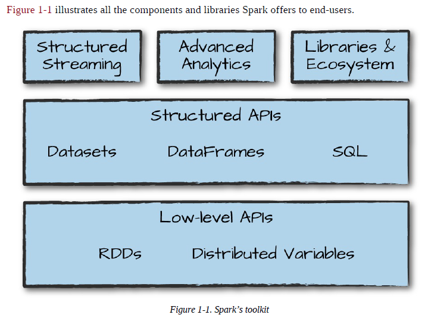

# What's Apache Spark?
Apache Spark is a unified computing engine and a set of libraries for parallel data processing on computer clusters. As of this writing, Spark is the most actively developed open source engine for this task, making it a standard tool for any developer or data scientist interested in big data. Spark supports multiple widely used programming languages (Python, Java, Scala, and R), includes libraries for diverse tasks ranging from SQL to streaming and machine learning, and runs anywhere from a laptop to a cluster of thousands of servers.

  

Typically, when you think of a “computer,” you think about one machine sitting on your desk at home or at work. This machine works perfectly well for watching movies or working with spreadsheet software. However, as many users likely experience at some point, there are some things that your computer is not powerful enough to perform. A cluster, or group, of computers, pools the resources of many machines together, giving us the ability to use all the cumulative resources as if they were a single computer. Now, a group of machines alone is not powerful, you need a framework to coordinate work across them. Spark does just that, managing and coordinating the execution of tasks on data across a cluster of computers.