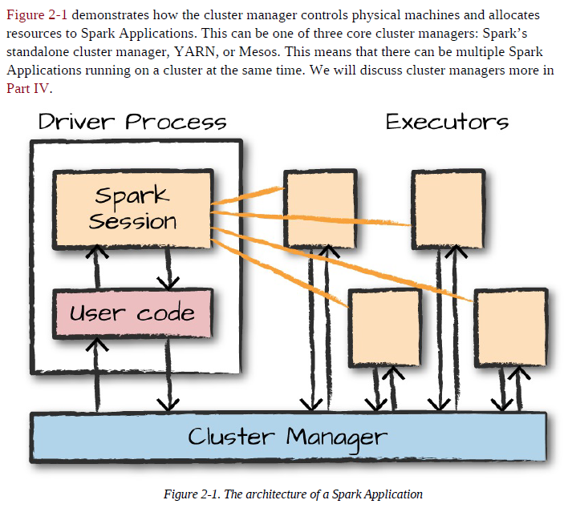
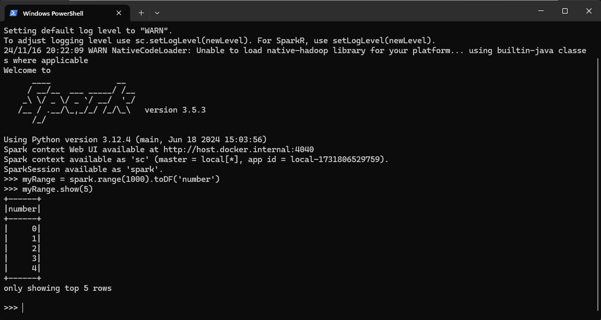

# Spark Applications

Spark Applications consist of a driver process and a set of executor processes. The driver process runs your main() function, sits on a node in the cluster, and is responsible for three things: 
* Maintaining information about the Spark Application.
* Responding to a user’s program or input.
* Analyzing, distributing, and scheduling work across the executors (discussed momentarily).

The executors are responsible for actually carrying out the work that the driver assigns them. This means that each executor is responsible for only two things: 
* Executing code assigned to it by the driver.
* Reporting the state of the computation on that executor back to the driver node.

  

* ***Note:*** Spark, in addition to its cluster mode, also has a local mode. The driver and executors are simply processes, which means that they can live on the same machine or different machines. In local mode, the driver and executurs run (as threads) on your individual computer instead of a cluster. We wrote this book with local mode in mind, so you should be able to run everything on a single machine.

## Spark Session

The SparkSession instance is the way Spark executes user-defined manipulations across the cluster. There is a one-to-one correspondence between a SparkSession and a Spark Application. To initizate for Python write in the terminal:

~~~shell
    pyspark
~~~

An example of Spark code:

~~~python
    myRange = spark.range(1000).toDF('number')
~~~

