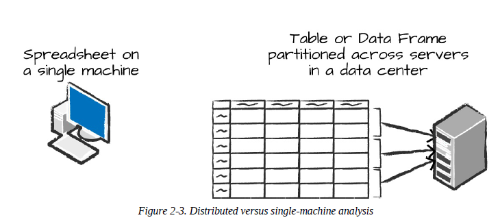
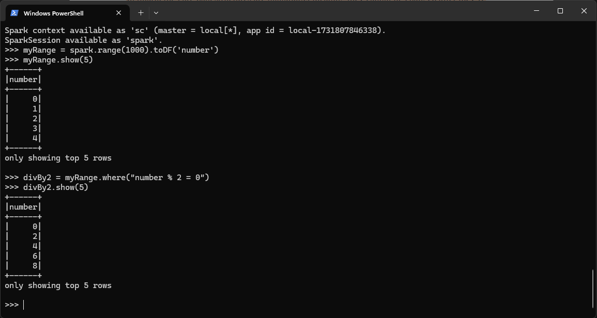
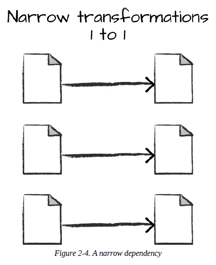
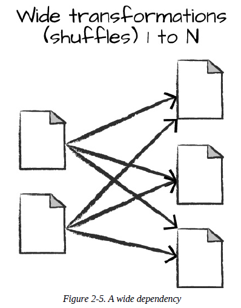
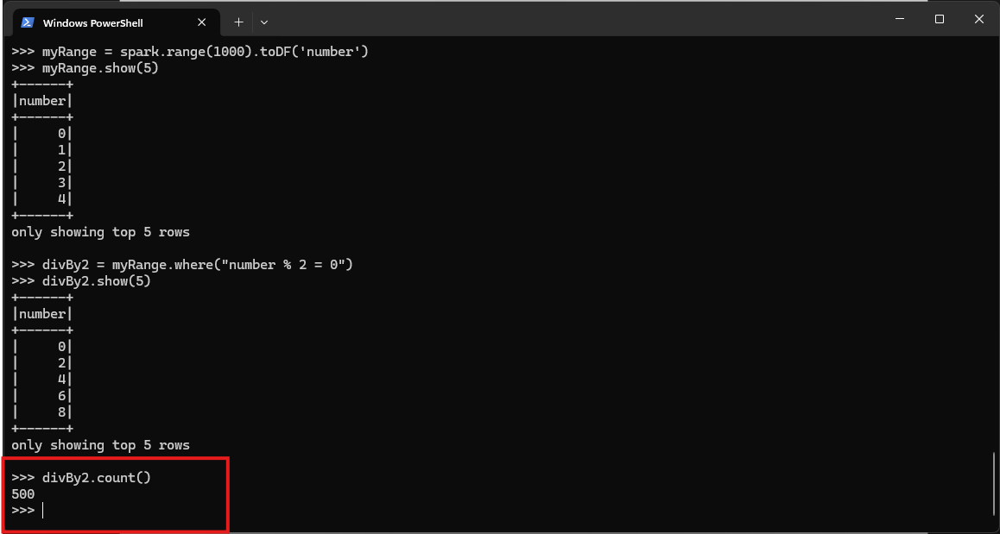

# Dataframes
A DataFrame is the most common Structured API and simply represents a table of data with rows and columns. The list that defines the columns and the types within those columns is called the schema.

  

The DataFrame concept is not unique to Spark. R and Python both have similar concepts. However, Python/R DataFrames (with some exceptions) exist on one machine rather than multiple machines. This limits what you can do with a given DataFrame to the resources that exist on that specific machine. However, because Spark has language interfaces for both Python and R, it’s quite easy to convert Pandas (Python) DataFrames to Spark DataFrames, and R DataFrames to Spark DataFrames.

## Partitions
To allow every executor to perform work in parallel, Spark breaks up the data into chunks called partitions. A partition is a collection of rows that sit on one physical machine in your cluster. A DataFrame’s partitions represent how the data is physically distributed across the cluster of machines during execution.

## Transformations

In Spark, the core data structures are immutable, meaning they cannot be changed after they’re created. This might seem like a strange concept at first: if you cannot change it, how are you supposed to use it? To “change” a DataFrame, you need to instruct Spark how you would like to modify it to do what you want. These instructions are called transformations.

~~~python
    divBy2 = myRange.where("number % 2 = 0")
~~~

  

Transformations are the core of how you express your business logic using Spark. There are two types of transformations: those that specify narrow dependencies, and those that specify wide dependencies.

***Narrow Transformations***
Transformations consisting of narrow dependencies (we’ll call them narrow transformations) are those for which each input partition will contribute to only one output partition. In the preceding code snippet, the where statement specifies a narrow dependency, where only one partition contributes to at most one output partition.

  

***Wide Transformations***
A wide dependency (or wide transformation) style transformation will have input partitions contributing to many output partitions. You will often hear this referred to as a shuffle whereby Spark will exchange partitions across the cluster. With narrow transformations, Spark will automatically perform an operation called pipelining, meaning that if we specify multiple filters on DataFrames, they’ll all be performed in-memory.

  

### Lazy Evalutation

Lazy evaulation means that Spark will wait until the very last moment to execute the graph of computation instructions. In Spark, instead of modifying the data immediately when you express some operation, you build up a plan of transformations that you would like to apply to your source data.

An example of this is something called predicate pushdown on DataFrames. If we build a large Spark job but specify a filter at the end that only requires us to fetch one row from our source data, the most efficient way to execute this is to access the single record that we need. Spark will actually optimize this for us by pushing the filter down automatically.

## Actions

Transformations allow us to build up our logical transformation plan. To trigger the computation, we run an action. An action instructs Spark to compute a result from a series of transformations. The simplest action is count, which gives us the total number of records in the DataFrame:

~~~python
    divBy2.count()
~~~

  

There are three kinds of actions:
* Actions to view data in the console
* Actions to collect data to native objects in the respective language
* Actions to write to output data sources