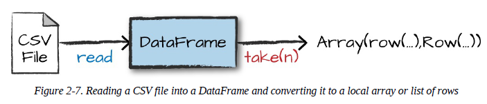
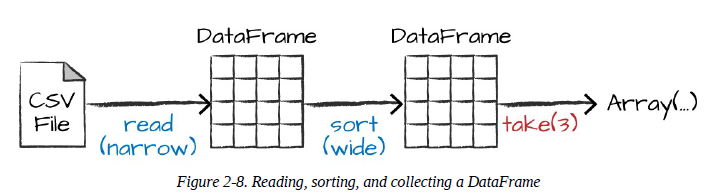
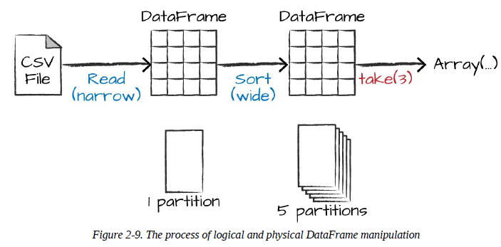
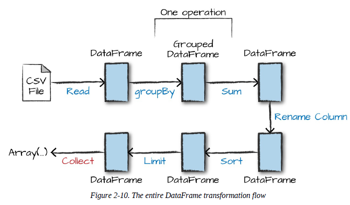

# Laboratory 1

We’ll use Spark to analyze some flight data from the United States Bureau of Transportation statistics. Inside of the CSV folder, you’ll see that we have a number of files. There’s also a number of other folders with different file formats, which we discuss in Chapter 9. For now, let’s focus on the CSV files. Each file has a number of rows within it. These files are CSV files, meaning that they’re a semistructured data format, with each row in the file representing a row in our future DataFrame:

~~~shell
    $ head /data/flight-data/csv/2015-summary.csv
    DEST_COUNTRY_NAME,ORIGIN_COUNTRY_NAME,count
    United States,Romania,15
    United States,Croatia,1
    United States,Ireland,344
~~~

Spark includes the ability to read and write from a large number of data sources. To read this data, we will use a DataFrameReader that is associated with our SparkSession. In doing so, we will specify the file format as well as any options we want to specify. In our case, we want to do something called schema inference, which means that we want Spark to take a best guess at what the schema of our DataFrame should be. We also want to specify that the first row is the header in the file, so we’ll specify that as an option, too.

To get the schema information, Spark reads in a little bit of the data and then attempts to parsethe types in those rows according to the types available in Spark. You also have the option of strictly specifying a schema when you read in data (which we recommend in production scenarios):

* **Python**
~~~python
    flightData2015 = spark\
    .read\
    .option("inferSchema", "true")\
    .option("header", "true")\
    .csv("/data/flight-data/csv/2015-summary.csv")
~~~

Each of these DataFrames (in Scala and Python) have a set of columns with an unspecified number of rows. The reason the number of rows is unspecified is because reading data is a transformation, and is therefore a lazy operation. Spark peeked at only a couple of rows of data to try to guess what types each column should be. Figure 2-7 provides an illustration of the CSV file being read into a DataFrame and then being converted into a local array or list of rows.

  

If we perform the take action on the DataFrame, we will be able to see the same results that we saw before when we used the command line:

~~~python
flightData2015.take(3)
~~~

~~~
Array([United States,Romania,15], [United States,Croatia...
~~~

Let’s specify some more transformations! Now, let’s sort our data according to the count column, which is an integer type. Figure 2-8 illustrates this process.

* ***Note:*** Remember, sort does not modify the DataFrame. We use sort as a transformation that returns a new DataFrame by transforming the previous DataFrame. Let’s illustrate what’s happening when we call take on that resulting DataFrame (Figure 2-8). 

  

Nothing happens to the data when we call sort because it’s just a transformation. However, we can see that Spark is building up a plan for how it will execute this across the cluster by looking at the explain plan. We can call explain on any DataFrame object to see the DataFrame’s lineage (or how Spark will execute this query):

~~~python
    flightData2015.sort("count").explain()
~~~
~~~
    == Physical Plan ==
    *Sort [count#195 ASC NULLS FIRST], true, 0
    +- Exchange rangepartitioning(count#195 ASC NULLS FIRST, 200)
    +- *FileScan csv [DEST_COUNTRY_NAME#193,ORIGIN_COUNTRY_NAME#194,count#195] ...
~~~

Congratulations, you’ve just read your first explain plan! Explain plans are a bit arcane, but with a bit of practice it becomes second nature. You can read explain plans from top to bottom, the top being the end result, and the bottom being the source(s) of data. In this case, take a look at the first keywords. You will see sort, exchange, and FileScan. That’s because the sort of our data is actually a wide transformation because rows will need to be compared with one another. Don’t worry too much about understanding everything about explain plans at this point, they can just be helpful tools for debugging and improving your knowledge as you progress with Spark.

Now, just like we did before, we can specify an action to kick off this plan. However, before doing that, we’re going to set a configuration. By default, when we perform a shuffle, Spark outputs 200 shuffle partitions. Let’s set this value to 5 to reduce the number of the output
partitions from the shuffle:

~~~python
spark.conf.set("spark.sql.shuffle.partitions", "5")
flightData2015.sort("count").take(2)
~~~
~~~
... Array([United States,Singapore,1], [Moldova,United States,1])
~~~

Figure 2-9 illustrates this operation. Notice that in addition to the logical transformations, we include the physical partition count, as well.

  

The logical plan of transformations that we build up defines a lineage for the DataFrame so that at any given point in time, Spark knows how to recompute any partition by performing all of the operations it had before on the same input data. This sits at the heart of Spark’s programming model—functional programming where the same inputs always result in the same outputs when the transformations on that data stay constant.

We do not manipulate the physical data; instead, we configure physical execution characteristics through things like the shuffle partitions parameter that we set a few moments ago. We ended up with five output partitions because that’s the value we specified in the shuffle partition. You can change this to help control the physical execution characteristics of your Spark jobs. Go ahead and experiment with different values and see the number of partitions yourself. In experimenting with different values, you should see drastically different runtimes. Remember that you can
monitor the job progress by navigating to the Spark UI on port 4040 to see the physical and logical execution characteristics of your jobs.

## DataFrames and SQL
We worked through a simple transformation in the previous example, let’s now work through a more complex one and follow along in both DataFrames and SQL. Spark can run the same transformations, regardless of the language, in the exact same way. You can express your business logic in SQL or DataFrames (either in R, Python, Scala, or Java) and Spark will compile that logic down to an underlying plan (that you can see in the explain plan) before actually executing your code. With Spark SQL, you can register any DataFrame as a table or view (a temporary table) and query it using pure SQL. There is no performance difference between writing SQL queries or writing DataFrame code, they both “compile” to the same underlying plan that we specify in DataFrame code.

You can make any DataFrame into a table or view with one simple method call:

~~~python
    flightData2015.createOrReplaceTempView("flight_data_2015")
~~~

Now we can query our data in SQL. To do so, we’ll use the spark.sql function (remember, spark is our SparkSession variable) that conveniently returns a new DataFrame. Although this might seem a bit circular in logic—that a SQL query against a DataFrame returns another DataFrame—it’s actually quite powerful. This makes it possible for you to specify transformations in the manner most convenient to you at any given point in time and not sacrifice any efficiency to do so! To understand that this is happening, let’s take a look at two explain plans:

* ***Python***
~~~python
    sqlWay = spark.sql("""
        SELECT 
            DEST_COUNTRY_NAME, 
            count(1)
        FROM flight_data_2015
        GROUP BY DEST_COUNTRY_NAME
    """)

    dataFrameWay = flightData2015\
            .groupBy("DEST_COUNTRY_NAME")\
            .count()
            sqlWay.explain()
    dataFrameWay.explain()
~~~

~~~
    == Physical Plan ==
    *HashAggregate(keys=[DEST_COUNTRY_NAME#182], functions=[count(1)])
    +- Exchange hashpartitioning(DEST_COUNTRY_NAME#182, 5)
    +- *HashAggregate(keys=[DEST_COUNTRY_NAME#182], functions=[partial_count(1)])
    +- *FileScan csv [DEST_COUNTRY_NAME#182] ...
    == Physical Plan ==
    *HashAggregate(keys=[DEST_COUNTRY_NAME#182], functions=[count(1)])
    +- Exchange hashpartitioning(DEST_COUNTRY_NAME#182, 5)
    +- *HashAggregate(keys=[DEST_COUNTRY_NAME#182], functions=[partial_count(1)])
    +- *FileScan csv [DEST_COUNTRY_NAME#182] ...
~~~
Notice that these plans compile to the exact same underlying plan!

Let’s pull out some interesting statistics from our data. One thing to understand is that
DataFrames (and SQL) in Spark already have a huge number of manipulations available. There
are hundreds of functions that you can use and import to help you resolve your big data problems faster. We will use the max function, to establish the maximum number of flights to and from any given location. This just scans each value in the relevant column in the DataFrame and checks whether it’s greater than the previous values that have been seen. This is a transformation, because we are effectively filtering down to one row. Let’s see what that looks like:

~~~python
    spark.sql("SELECT max(count) from flight_data_2015").take(1)
~~~

* ***Python***
~~~python
    from pyspark.sql.functions import max
    flightData2015.select(max("count")).take(1)
~~~

Great, that’s a simple example that gives a result of 370,002. Let’s perform something a bit more complicated and find the top five destination countries in the data. This is our first multitransformation query, so we’ll take it step by step. Let’s begin with a fairly straightforward SQL aggregation:

* ***Python***

~~~python
    maxSql = spark.sql("""
        SELECT 
            DEST_COUNTRY_NAME, 
            sum(count) as destination_total
        FROM flight_data_2015
        GROUP BY DEST_COUNTRY_NAME
        ORDER BY sum(count) DESC
        LIMIT 5
    """)
    maxSql.show()
~~~
~~~
    +-----------------+-----------------+
    |DEST_COUNTRY_NAME|destination_total|
    +-----------------+-----------------+
    | United States| 411352|
    | Canada| 8399|
    | Mexico| 7140|
    | United Kingdom| 2025|
    | Japan| 1548|
    +-----------------+-----------------+
~~~

Now, let’s move to the DataFrame syntax that is semantically similar but slightly different in implementation and ordering. But, as we mentioned, the underlying plans for both of them are the same. Let’s run the queries and see their results as a sanity check:

* ***Python***

~~~python
    from pyspark.sql.functions import desc
    flightData2015\
        .groupBy("DEST_COUNTRY_NAME")\
        .sum("count")\
        .withColumnRenamed("sum(count)", "destination_total")\
        .sort(desc("destination_total"))\
        .limit(5)\
        .show()
~~~
~~~
    +-----------------+-----------------+
    |DEST_COUNTRY_NAME|destination_total|
    +-----------------+-----------------+
    | United States| 411352|
    | Canada| 8399|
    | Mexico| 7140|
    | United Kingdom| 2025|
    | Japan| 1548|
    +-----------------+-----------------+
~~~

Now there are seven steps that take us all the way back to the source data. You can see this in the explain plan on those DataFrames. Figure 2-10 shows the set of steps that we perform in “code.” The true execution plan (the one visible in explain) will differ from that shown in Figure 2-10 because of optimizations in the physical execution; however, the llustration is as good of a starting point as any. This execution plan is a directed acyclic graph (DAG) of transformations, each resulting in a new immutable DataFrame, on which we call an action to generate a result.

  

The first step is to read in the data. We defined the DataFrame previously but, as a reminder,
Spark does not actually read it in until an action is called on that DataFrame or one derived from the original DataFrame.

The second step is our grouping; technically when we call groupBy, we end up with a RelationalGroupedDataset, which is a fancy name for a DataFrame that has a grouping specified but needs the user to specify an aggregation before it can be queried further. We basically specified that we’re going to be grouping by a key (or set of keys) and that now we’re going to perform an aggregation over each one of those keys.

Therefore, the third step is to specify the aggregation. Let’s use the sum aggregation method. This takes as input a column expression or, simply, a column name. The result of the sum method call is a new DataFrame. You’ll see that it has a new schema but that it does know the type of each column. It’s important to reinforce (again!) that no computation has been performed. This is simply another transformation that we’ve expressed, and Spark is simply able to trace our type information through it.

The fourth step is a simple renaming. We use the withColumnRenamed method that takes two arguments, the original column name and the new column name. Of course, this doesn’t perform computation: this is just another transformation!

The fifth step sorts the data such that if we were to take results off of the top of the DataFrame, they would have the largest values in the destination_total column. You likely noticed that we had to import a function to do this, the desc function. You might also have noticed that desc does not return a string but a Column. In general, many DataFrame methods will accept strings (as column names) or Column types or expressions. Columns and expressions are actually the exact same thing.

Penultimately, we’ll specify a limit. This just specifies that we only want to return the first five values in our final DataFrame instead of all the data.

The last step is our action! Now we actually begin the process of collecting the results of our DataFrame, and Spark will give us back a list or array in the language that we’re executing. To reinforce all of this, let’s look at the explain plan for the previous query:
* ***Python***
~~~python
    flightData2015.groupBy("DEST_COUNTRY_NAME")\
        .sum("count")\
        .withColumnRenamed("sum(count)", "destination_total")\
        .sort(desc("destination_total"))\
        .limit(5)\
        .explain()
~~~

~~~
    == Physical Plan ==
    TakeOrderedAndProject(limit=5, orderBy=[destination_total#16194L DESC], outpu...
    +- *HashAggregate(keys=[DEST_COUNTRY_NAME#7323], functions=[sum(count#7325L)])
    +- Exchange hashpartitioning(DEST_COUNTRY_NAME#7323, 5)
    +- *HashAggregate(keys=[DEST_COUNTRY_NAME#7323], functions=[partial_sum...
    +- InMemoryTableScan [DEST_COUNTRY_NAME#7323, count#7325L]
    +- InMemoryRelation [DEST_COUNTRY_NAME#7323, ORIGIN_COUNTRY_NA...
    +- *Scan csv [DEST_COUNTRY_NAME#7578,ORIGIN_COUNTRY_NAME...
~~~

Although this explain plan doesn’t match our exact “conceptual plan,” all of the pieces are there. You can see the limit statement as well as the orderBy (in the first line). You can also see how our aggregation happens in two phases, in the partial_sum calls. This is because summing a list of numbers is commutative, and Spark can perform the sum, partition by partition. Of course we can see how we read in the DataFrame, as well. 

Naturally, we don’t always need to collect the data. We can also write it out to any data source that Spark supports. For instance, suppose we want to store the information in a database like PostgreSQL or write them out to another file.