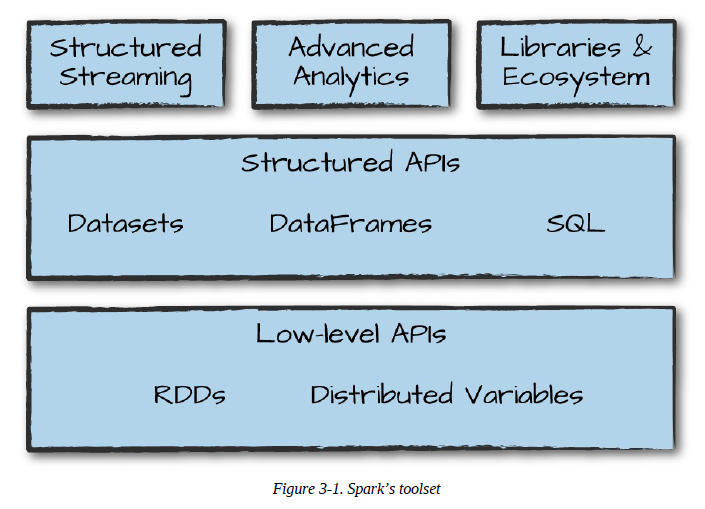
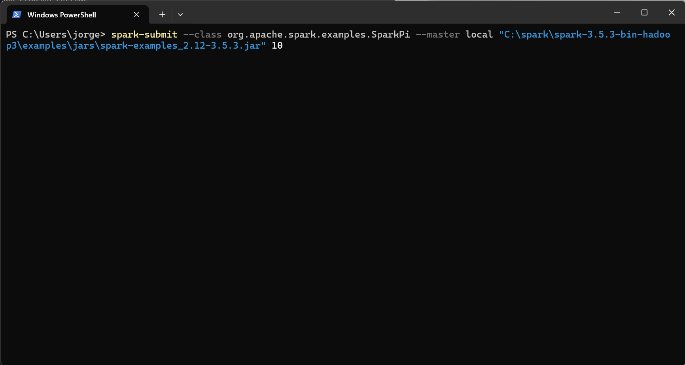
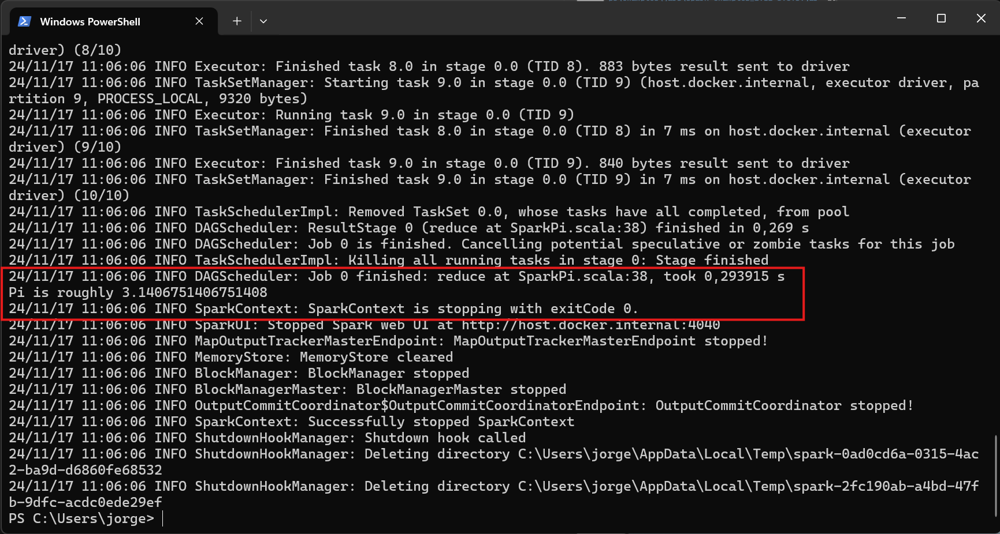

# Spark Toolset

Spark is composed of these primitives—the lower-level APIs and the Structured APIs—and then a series of standard libraries for additional functionality.

  

Spark’s libraries support a variety of different tasks, from graph analysis and machine learning to streaming and integrations with a host of computing and storage systems.

## Running Production Application

Spark makes it easy to develop and create big data programs. Spark also makes it easy to turn your interactive exploration into production applications with **spark-submit**, a built-in command-line tool. **spark-submit** does one thing: it lets you send your application code to a cluster and launch it to execute there. Upon submission, the application will run until it exits (completes the task) or encounters an error.

**spark-submit** offers several controls with which you can specify the resources your applicationneeds as well as how it should be run and its command-line arguments. You can write applications in any of Spark’s supported languages and then submit them for execution. The simplest example is running an application on your local machine.

~~~shell
    ./bin/spark-submit --class org.apache.spark.examples.SparkPi --master local ./examples/jars/spark-examples_2.11-2.2.0.jar 10
~~~

  

This sample application calculates the digits of pi to a certain level of estimation. Here, we’ve told spark-submit that we want to run on our local machine, which class and which JAR we would like to run, and some command-line arguments for that class.

  

## Datasets: Type-Safe Structured APIs

The first API we’ll describe is a type-safe version of Spark’s structured API called **Datasets**, for writing statically typed code in Java and Scala. The Dataset API is not available in Python and R, because those languages are dynamically typed.

The Dataset API gives users the ability to assign a Java/Scala class to the records within a DataFrame and manipulate it as a collection of typed objects, similar to a Java ArrayList or Scala Seq. The APIs available on **Datasets** are type-safe, meaning that you cannot accidentally view the objects in a Dataset as being of another class than the class you put in initially. This makes **Datasets** especially attractive for writing large applications, with which multiple software engineers must interact through well-defined interfaces.

The Dataset class is parameterized with the type of object contained inside: **Dataset\<T>** in Java and **Dataset[T]** in Scala. For example, a **Dataset[Person]** will be guaranteed to contain objects of class Person.

One great thing about **Datasets** is that you can use them only when you need or want to. For instance, in the following example, we’ll define our own data type and manipulate it via arbitrary map and filter functions. After we’ve performed our manipulations, Spark can automatically turn it back into a DataFrame, and we can manipulate it further by using the hundreds of functions that Spark includes.

~~~scala
    case class Flight(DEST_COUNTRY_NAME: String,ORIGIN_COUNTRY_NAME: String, count: BigInt)

    val flightsDF = spark.read
            .parquet("/data/flight-data/parquet/2010-summary.parquet/")

    val flights = flightsDF.as[Flight]
~~~

One final advantage is that when you call collect or take on a Dataset, it will collect objects ofthe proper type in your Dataset, not DataFrame Rows.

~~~scala
    flights.filter(flight_row => flight_row.ORIGIN_COUNTRY_NAME != "Canada")
        .map(flight_row => flight_row)
        .take(5)

    flights.take(5)
        .filter(flight_row => flight_row.ORIGIN_COUNTRY_NAME != "Canada")
        .map(fr => Flight(fr.DEST_COUNTRY_NAME, fr.ORIGIN_COUNTRY_NAME, fr.count + 5))
~~~

## Structured Streaming

**Structured Streaming** is a high-level API for stream processing that you can take the same operations that you perform in batch mode using Spark’s structured APIs and run them in a streaming fashion. This can reduce latency and allow for incremental processing. **Structured Streaming** allows you to rapidly and quickly extract value out of streaming systems with virtually no code changes. It also makes it easy to conceptualize because you can write your batch job as a way to prototype it and then you can convert it to a streaming job. The way all of this works is by incrementally processing that data.

Let’s walk through a simple example of how easy it is to get started with **Structured Streaming**. For this, we will use a *retail dataset*, one that has specific dates and times for us to be able to use. We will use the “by-day” set of files, in which one file represents one day of data.

It’s also worth sharing a sample of the data so you can reference what the data looks like:
~~~
    InvoiceNo,StockCode,Description,Quantity,InvoiceDate,UnitPrice,CustomerID,Country
    536365,85123A,WHITE HANGING HEART T-LIGHT HOLDER,6,2010-12-01 08:26:00,2.55,17...
    536365,71053,WHITE METAL LANTERN,6,2010-12-01 08:26:00,3.39,17850.0,United Kin...
    536365,84406B,CREAM CUPID HEARTS COAT HANGER,8,2010-12-01 08:26:00,2.75,17850...
~~~
We’ll also create a schema from this static dataset

~~~python
    staticDataFrame = spark.read.format("csv")\
        .option("header", "true")\
        .option("inferSchema", "true")\
        .load("/data/retail-data/by-day/*.csv")

    staticDataFrame.createOrReplaceTempView("retail_data")

    staticSchema = staticDataFrame.schema
~~~

This is still a *lazy operation*, so we will need to call a streaming action to start the execution of this data flow.

Streaming actions are a bit different from our conventional static action because we’re going to be populating data somewhere instead of just calling something like count (which doesn’t make any sense on a stream anyways). The action we will use will output to an in-memory table that we will update after each trigger. In this case, each trigger is based on an individual file (the read option that we set).

~~~python
    purchaseByCustomerPerHour.writeStream\
        .format("memory")\
        .queryName("customer_purchases")\
        .outputMode("complete")\
        .start()
~~~

When we start the stream, we can run queries against it to debug what our result will look like if we were to write this out to a production sink:

~~~python
    spark.sql("""
        SELECT *
        FROM customer_purchases
        ORDER BY `sum(total_cost)` DESC
    """)\
    .show(5)
~~~

You’ll notice that the composition of our table changes as we read in more data! With each file, the results might or might not be changing based on the data. Naturally, because we’re grouping customers, we hope to see an increase in the top customer purchase amounts over time (and do for a period of time!).

## Machine Learning and Advance Analytics

Another popular aspect of Spark is its ability to perform large-scale machine learning with a built-in library of machine learning algorithms called **MLlib**. **MLlib** allows for preprocessing, munging, training of models, and making predictions at scale on data. You can even use models trained in **MLlib** to make predictions in Strucutred Streaming. To demonstrate this functionality, we will perform some basic clustering on our data using a standard algorithm called k-means.

Spark includes a number of preprocessing methods out of the box. To demonstrate these methods, we will begin with some raw data, build up transformations before getting the data into the right format, at which point we can actually train our model and then serve predictions:

~~~python
    staticDataFrame.printSchema()
~~~

~~~
    root
    |-- InvoiceNo: string (nullable = true)
    |-- StockCode: string (nullable = true)
    |-- Description: string (nullable = true)
    |-- Quantity: integer (nullable = true)
    |-- InvoiceDate: timestamp (nullable = true)
    |-- UnitPrice: double (nullable = true)
    |-- CustomerID: double (nullable = true)
    |-- Country: string (nullable = true)
~~~

Machine learning algorithms in MLlib require that data is represented as numerical values. Our current data is represented by a variety of different types, including timestamps, integers, and strings. Therefore we need to transform this data into some numerical representation.

~~~python
    from pyspark.sql.functions import date_format, col

    preppedDataFrame = staticDataFrame.na.fill(0)\
        .withColumn("day_of_week", date_format(col("InvoiceDate"), "EEEE"))\
        .coalesce(5)
~~~

We are also going to need to split the data into training and test sets. In this instance, we are going to do this manually by the date on which a certain purchase occurred; however, we could also use MLlib’s transformation APIs to create a training and test set via train validation splits or cross validation.

~~~python
    trainDataFrame = preppedDataFrame.where("InvoiceDate < '2011-07-01'")
    testDataFrame = preppedDataFrame.where("InvoiceDate >= '2011-07-01'")
~~~

Although this might not be the optimal split for our training and test, for the intents and purposes of this example it will work just fine. We’ll see that this splits our dataset roughly in half:

~~~python
    trainDataFrame.count()
    testDataFrame.count()
~~~

Spark’s **MLlib** also provides a number of transformations with which we can automate some of our general transformations. One such transformer is a *StringIndexer*:

~~~python
    from pyspark.ml.feature import StringIndexer

    indexer = StringIndexer().setInputCol("day_of_week")\
    .setOutputCol("day_of_week_index")
~~~

This will turn our days of weeks into corresponding numerical values. For example, Spark might represent Saturday as 6, and Monday as 1. However, with this numbering scheme, we are implicitly stating that Saturday is greater than Monday (by pure numerical values). This is obviously incorrect. To fix this, we therefore need to use a OneHotEncoder to encode each of these values as their own column. These Boolean flags state whether that day of week is the relevant day of the week:

~~~python
    from pyspark.ml.feature import OneHotEncoder

    encoder = OneHotEncoder().setInputCol("day_of_week_index")\
    .setOutputCol("day_of_week_encoded")
~~~

Each of these will result in a set of columns that we will “assemble” into a vector. All machine learning algorithms in Spark take as input a Vector type, which must be a set of numerical values:

~~~python
    from pyspark.ml.feature import VectorAssembler

    vectorAssembler = VectorAssembler().setInputCols(["UnitPrice", "Quantity", "day_of_week_encoded"])\
    .setOutputCol("features")
~~~

Here, we have three key features: the price, the quantity, and the day of week. Next, we’ll set this up into a pipeline so that any future data we need to transform can go through the exact same process:

~~~python
    from pyspark.ml import Pipeline
    
    transformationPipeline = Pipeline().setStages([indexer, encoder, vectorAssembler])
~~~

Preparing for training is a two-step process. We first need to fit our transformers to this dataset, basically our StringIndexer needs to know how many unique values there are to be indexed. After those exist, encoding is easy but Spark must look at all the distinct values in the column to be indexed in order to store those values later on:

~~~python
    fittedPipeline = transformationPipeline.fit(trainDataFrame)
~~~

After we fit the training data, we are ready to take that fitted pipeline and use it to transform all of our data in a consistent and repeatable way:

~~~python
    transformedTraining = fittedPipeline.transform(trainDataFrame)
~~~

At this point, it’s worth mentioning that we could have included our model training in our pipeline. We chose not to in order to demonstrate a use case for caching the data. Instead, we’re going to perform some hyperparameter tuning on the model because we do not want to repeat the exact same transformations over and over again; specifically, we’ll use caching.

This will put a copy of the intermediately transformed dataset into memory, allowing us to repeatedly access it at much lower cost than running the entire pipeline again.

~~~python
    transformedTraining.cache()
~~~

We now have a training set; it’s time to train the model. First we’ll import the relevant model that we’d like to use and instantiate it:

~~~python
    from pyspark.ml.clustering import KMeans

    kmeans = KMeans().setK(20)\
    .setSeed(1L)
~~~

In Spark, training machine learning models is a two-phase process. First, we initialize an untrained model, and then we train it. There are always two types for every algorithm in MLlib’s DataFrame API. They follow the naming pattern of Algorithm, for the untrained version, and AlgorithmModel for the trained version. In our example, this is KMeans and then KMeansModel.

Estimators in MLlib’s DataFrame API share roughly the same interface that we saw earlier with our preprocessing transformers like the StringIndexer. This should come as no surprise because it makes training an entire pipeline (which includes the model) simple. For our purposes here, we want to do things a bit more step by step, so we chose to not do this in this example:

~~~python
    kmModel = kmeans.fit(transformedTraining)
~~~

After we train this model, we can compute the cost according to some success merits on our training set. The resulting cost on this dataset is actually quite high, which is likely due to the fact that we did not properly preprocess and scale our input data.

~~~python
    kmModel.computeCost(transformedTraining)

    transformedTest = fittedPipeline.transform(testDataFrame)
    
    kmModel.computeCost(transformedTest)
~~~

Naturally, we could continue to improve this model, layering more preprocessing as well as performing hyperparameter tuning to ensure that we’re getting a good model.

## Lower-level APIs

