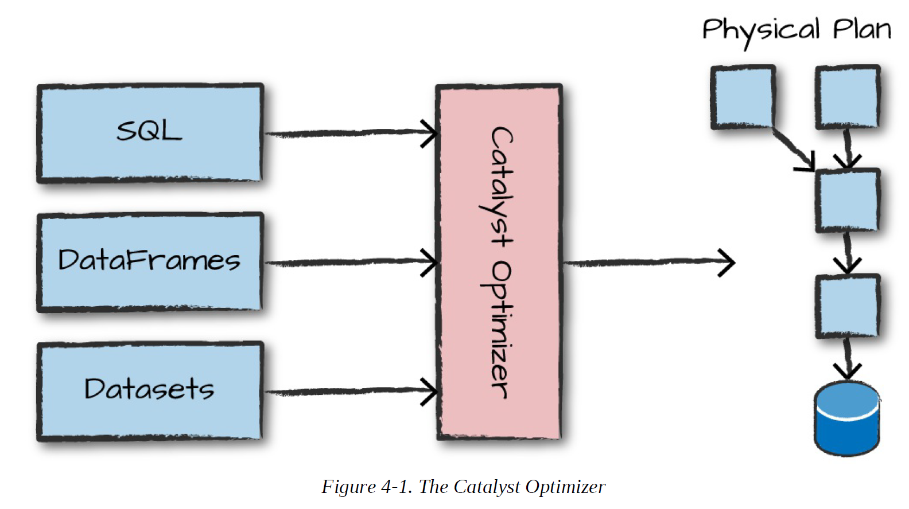

# Structuted APIs

The Structured APIs are a tool for manipulating all sorts of data, from unstructured log files to semi-structured CSV files and highly structured Parquet files. These APIs refer to three core types of distributed collection APIs:

* Datasets
* DataFrames
* SQL tables and views

The majority of the Structured APIs apply to both batch and streaming computation. This means that when you work with the Structured APIs, it should be simple to migrate from batch to streaming (or vice versa) with little to no effort.

The Structured APIs are the fundamental abstraction that you will use to write the majority of your data flows.we’ll introduce the fundamental concepts that you should understand: the typed and untyped APIs (and their differences); what the core terminology is; and, finally, how Spark actually takes your Structured API data flows and executes it on the cluster. We will then provide more specific task-based information for working with certain types of data or data sources.

* ***Reminder:*** Spark is a distributed programming model in which the user specifies transformations. Multiple transformations build up a directed acyclic graph of instructions. An action begins the process of executing that graph of instructions, as a single job, by breaking it down into stages and tasks to execute across the cluster. The logical structures that we manipulate with transformations and actions are DataFrames and Datasets. To create a new DataFrame or Dataset, you call a transformation. To start computation or convert to native language types, you call an action.

## DataFrames y DataSets

DataFrames and Datasets are (distributed) table-like collections with well-defined rows and columns. Each column must have the same number of rows as all the other columns (although you can use null to specify the absence of a value) and each column has type information that must be consistent for every row in the collection.

DataFrames and Datasets represent immutable, lazily evaluated plans that specify what operations to apply to data residing at a location to generate some output. When we perform an action on a DataFrame, we instruct Spark to perform the actual transformations and return the result.

* **Note:** Tables and views are basically the same thing as DataFrames. We just execute SQL against them instead of DataFrame code.

### Schemas

A schema defines the column names and types of a DataFrame. You can define schemas manually or read a schema from a data source (often called schema on read).

## Overview of Structured Spark Types

Spark is effectively a programming language of its own. Internally, Spark uses an engine called Catalyst that maintains its own type information through the planning and processing of work. Spark types map directly to the different language APIs that Spark maintains and there exists a lookup table for each of these in Scala, Java, Python, SQL, and R.Even if we use Spark’s Structured APIs from Python or R, the majority of our manipulations will operate strictly on Spark types, not Python types. For example, the following code does not perform addition in Scala or Python; it actually performs addition purely in Spark:

~~~python
    df = spark.range(500).toDF("number")
    df.select(df["number"] + 10)
~~~

### DataFrames Versus Datasets

In essence, within the Structured APIs, there are two more APIs, the “untyped” DataFrames and the “typed” Datasets.Datasets, on the other hand, check whether types conform to the specification at compile time. Datasets are only available to Java Virtual Machine (JVM)– based languages (Scala and Java) and we specify types with case classes or Java beans.For the most part, you’re likely to work with DataFrames. To Spark (in Scala), DataFrames are simply Datasets of Type Row. The “Row” type is Spark’s internal representation of its optimized in-memory format for computation.

### Columns

Columns represent a simple type like an integer or string, a complex type like an array or map, or a null value.

### Rows

A row is nothing more than a record of data. Each record in a DataFrame must be of type Row, as we can see when we collect the following DataFrames. We can create these rows manually from SQL, from Resilient Distributed Datasets (RDDs), from data sources, or manually from scratch.

### Spark Types

We mentioned earlier that Spark has a large number of internal type representations. We include a handy reference table on the next several pages so that you can most easily reference what type, in your specific language, lines up with the type in Spark.To work with the correct Python types, use the following:

~~~python
    from pyspark.sql.types import *
    b = ByteType()
~~~

The following tables provide the detailed type information for each of Spark’s language bindings.

|**Data Type**|**Value Type in Python**|**API in Spark**|
|:-----------:|:----------------------|:--------------|
|ByteType|int or long. Note: Numbers will be converted to 1-byte signed integer numbers at runtime. Ensure that numbers are within the range of –128 to 127.|ByteType()|
|ShortType|int or long. Note: Numbers will be converted to 2-byte signed integer numbers at runtime. Ensure that numbers are within the range of –32768 to 32767.|ShortType()|
|IntegerType|int or long. Note: Python has a lenient definition of “integer.” Numbers that are too large will be rejected by Spark SQL if you use the IntegerType(). It’s best practice to use LongType.|IntegerType()|
|LongType|long. Note: Numbers will be converted to 8-byte signed integer numbers at runtime. Ensure that numbers are within the range of –9223372036854775808 to 9223372036854775807. Otherwise, convert data to decimal.Decimal and use DecimalType.|LongType()|
|FloatType|float. Note: Numbers will be converted to 4-byte singleprecision floating-point numbers at runtime.|FloatType()|
|DoubleType|float|DoubleType()|
|DecimalType|decimal.Decimal|DecimalType()|
|StringType|string|StringType()|
|BinaryType|bytearray|BinaryType()|
|BooleanType|bool|BooleanType()|
|TimestampType|datetime.datetime|TimestampType()|
|DateType|datetime.date|DateType()|
|ArrayType|list, tuple, or array|ArrayType(elementType, [containsNull]). Note: The default value of containsNull is True.|
|MapType|dict|MapType(keyType, valueType, [valueContainsNull]). Note: The default value of valueContainsNull is True.|
|StructType|list or tuple|StructType(fields). Note: fields is a list of StructFields. Also, fields StructFields. Also, fields with the same name are not allowed.|
|StructField|The value type in Python of the data type of this field (for example, Int for a StructField with the data type IntegerType)|StructField(name, dataType, [nullable]) Note: The default value of nullable is True.|

It’s worth keeping in mind that the types might change over time as Spark SQL continues to grow so you may want to reference [Spark’s documentation](https://spark.apache.org/docs/latest/sql-programming-guide.html#data-types) for future updates. Of course, all of these types are great, but you almost never work with purely static DataFrames. You will always manipulate and transform them.

## Overview of Structured API Execution

This will demonstrate how this code is actually executed across a cluster. This will help you understand (and potentially debug) the process of writing and executing code on clusters, so let’s walk through the execution of a single structured API query from user code to executed code. Here’s an overview of the steps:

1. Write DataFrame/Dataset/SQL Code.
2. If valid code, Spark converts this to a Logical Plan.
3. Spark transforms this Logical Plan to a Physical Plan, checking for optimizations along
the way.
4. Spark then executes this Physical Plan (RDD manipulations) on the cluster.

To execute code, we must write code. This code is then submitted to Spark either through the console or via a submitted job. This code then passes through the Catalyst Optimizer, which decides how the code should be executed and lays out a plan for doing so before, finally, the code is run and the result is returned to the user. 

  

### Logical Planning

The first phase of execution is meant to take user code and convert it into a logical plan.This logical plan only represents a set of abstract transformations that do not refer to executors or drivers, it’s purely to convert the user’s set of expressions into the most optimized version. It does this by converting user code into an unresolved logical plan. Spark uses the catalog, a repository of all table and DataFrame information, to resolve columns and tables in the analyzer. If the analyzer can resolve it, the result is passed through the Catalyst Optimizer, a collection of rules that attempt to optimize the logical plan by pushing down predicates or selections.

### Physical Planning

The physical plan, often called a Spark plan, specifies how the logical plan will execute on the cluster by generating different physical execution strategies and comparing them through a cost model. An example of the cost comparison might be choosing how to perform a given join by looking at the physical attributes of a given table (how big the table is or how big its partitions are).

  

Physical planning results in a series of RDDs and transformations. This result is why you might have heard Spark referred to as a compiler—it takes queries in DataFrames, Datasets, and SQL.

### Execution

Upon selecting a physical plan, Spark runs all of this code over RDDs, the lower-level programming interface of Spark.park performs further optimizations at runtime, generating native Java bytecode that can remove entire tasks or stages during execution. Finally the result is returned to the user.