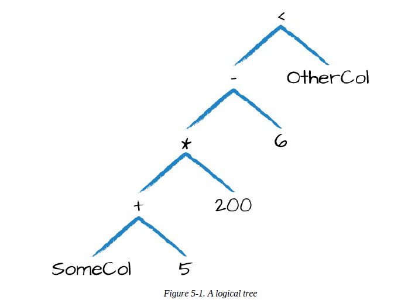
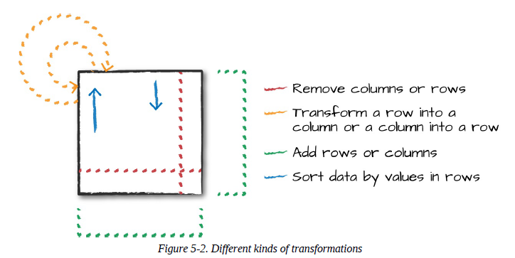

# Basic Structured Operations

Definitionally, a DataFrame consists of a series of records (like rows in a table), that are of type Row, and a number of columns (like columns in a spreadsheet) that represent a computation expression that can be performed on each individual record in the Dataset. Schemas define the name as well as the type of data in each column. Partitioning of the DataFrame defines the layout of the DataFrame or Dataset’s physical distribution across the cluster. The partitioning scheme defines how that is allocated. You can set this to be based on values in a certain column or nondeterministically. To create a DataFrame  we use:

~~~python
    df = spark.read.format("json").load("/data/flight-data/json/2015-summary.json")
~~~

## Schemas

A schema defines the column names and types of a DataFrame. We can either let a data source define the schema (called schema-on-read) or we can define it explicitly ourselves.

* ***Notes:*** When using Spark for production Extract, Transform, and Load (ETL), it is often a good idea to define your schemas manually, especially when working with untyped data sources like CSV and JSON because schema inference can vary depending on the type of data that you read in.

~~~python
    df.printSchema()
~~~

This is flight data from the United States Bureau of Transportation statistics:

~~~python
    spark.read.format("json").load("/data/flight-data/json/2015-summary.json").schema
~~~

The Output is:

~~~
    StructType(List(StructField(DEST_COUNTRY_NAME,StringType,true),
    StructField(ORIGIN_COUNTRY_NAME,StringType,true),
    StructField(count,LongType,true)))
~~~

A schema is a **StructType** made up of a number of fields, **StructFields**, that have a name, type, a *Boolean* flag which specifies whether that column can contain missing or null values, and, finally, users can optionally specify associated metadata with that column.
If the types in the data (at runtime) do not match the schema, Spark will throw an error. The example that follows shows how to create and enforce a specific schema on a DataFrame.

~~~python
    from pyspark.sql.types import StructField, StructType, StringType, LongType

    myManualSchema = StructType([
        StructField("DEST_COUNTRY_NAME", StringType(), True),
        StructField("ORIGIN_COUNTRY_NAME", StringType(), True),
        StructField("count", LongType(), False, metadata={"hello":"world"})
    ])

    df = spark.read.format("json").schema(myManualSchema)\
    .load("/data/flight-data/json/2015-summary.json")
~~~

We cannot simply set types via the per-language types because Spark maintains its own type information.

## Columns and Expressions

Columns in Spark are similar to columns in a spreadsheet, R dataframe, or pandas DataFrame. You can select, manipulate, and remove columns from DataFrames and these operations are represented as expressions.

### Columns

There are a lot of different ways to construct and refer to columns but the two simplest ways are by using the **col** or **column** functions.

~~~python
    from pyspark.sql.functions import col, column
    
    col("someColumnName")
    column("someColumnName")
~~~

#### Explicit column references

If you need to refer to a specific DataFrame’s column, you can use the col method on the specific DataFrame. This can be useful when you are performing a join and need to refer to a specific column in one DataFrame that might share a name with another column in the joined DataFrame.

~~~python
    df.col("count")
~~~

### Expressions

An expression is a set of transformations on one or more values in a record in a DataFrame, is like a function that takes as input one or more column names, resolves them, and then potentially applies more expressions to create a single value for each record in the dataset.

In the simplest case, an expression, created via the expr function, is just a DataFrame column reference. In the simplest case, expr("someCol") is equivalent to col("someCol"). Let’s ground this with an example:

~~~python
    (((col("someCol") + 5) * 200) - 6) < col("otherCol")
~~~

  

This might look familiar because it’s a directed acyclic graph. This graph is represented equivalently by the following code:

~~~python
    from pyspark.sql.functions import expr

    expr("(((someCol + 5) * 200) - 6) < otherCol")
~~~

Notice how the previous expression is actually valid SQL code, as well, just like you might put in a statement? That’s because this SQL SELECT expression and the previous DataFrame code compile to the same underlying logical tree prior to execution.

#### Accessing a DataFrame’s columns

Sometimes, you’ll need to see a DataFrame’s columns, which you can do by using something like printSchema; however, if you want to programmatically access columns, you can use the columns property to see all columns on a DataFrame:

~~~python
    spark.read.format("json").load("/data/flight-data/json/2015-summary.json").columns
~~~

## Records and Rows

In Spark, each row in a DataFrame is a single record. Spark represents this record as an object of type Row. Spark manipulates Row objects using column expressions in order to produce usable values. Row objects internally represent arrays of bytes. By calling first on a DataFrame, you can see the first row.

~~~python
    df.first()
~~~

### Creating Rows

You can create rows by manually instantiating a Row object with the values that belong in each column.

~~~python
    from pyspark.sql import Row
    myRow = Row("Hello", None, 1, False)
~~~

Accessing data in rows is equally as easy: you just specify the position that you would like. In Python or R, the value will automatically be coerced into the correct type:

~~~python
    myRow[0]
    myRow[2]
~~~

## DataFrame Transformations

When working with individual DataFrames there are some fundamental objectives. These break down into several core operations:

* We can add rows or columns
* We can remove rows or columns
* We can transform a row into a column (or vice versa)
* We can change the order of rows based on the values in columns

  

### Creating DataFrames

As we saw previously, we can create DataFrames from raw data sources.

~~~python
    df = spark.read.format("json").load("/data/flight-data/json/2015-summary.json")
    df.createOrReplaceTempView("dfTable")
~~~

We can also create DataFrames on the fly by taking a set of rows and converting them to a DataFrame.

~~~python
    from pyspark.sql import Row
    from pyspark.sql.types import StructField, StructType, StringType, LongType
    myManualSchema = StructType([
        StructField("some", StringType(), True),
        StructField("col", StringType(), True),
        StructField("names", LongType(), False)
    ])
    myRow = Row("Hello", None, 1)
    myDf = spark.createDataFrame([myRow], myManualSchema)
    myDf.show()
~~~

#### Select and selectExpr

**select** and **selectExpr** allow you to do the DataFrame equivalent of SQL queries on a table of data:

~~~SQL
    SELECT * FROM dataFrameTable
    SELECT columnName FROM dataFrameTable
    SELECT columnName * 10, otherColumn, someOtherCol as c FROM dataFrameTable
~~~

In the simplest possible terms, you can use them to manipulate columns in your DataFrames. The easiest way is just to use the **select** method and pass in the column names as strings with which you would like to work:

~~~SQL
    SELECT DEST_COUNTRY_NAME FROM dfTable LIMIT 2
~~~

~~~python
    df.select("DEST_COUNTRY_NAME").show(2)
~~~

Output:

~~~
    +-----------------+
    |DEST_COUNTRY_NAME|
    +-----------------+
    | United States   |
    | United States   |
    +-----------------+
~~~

You can **select** multiple columns by using the same style of query, just add more column name strings to your select method call:

~~~SQL
    SELECT DEST_COUNTRY_NAME, ORIGIN_COUNTRY_NAME FROM dfTable LIMIT 2
~~~

~~~python
    df.select("DEST_COUNTRY_NAME", "ORIGIN_COUNTRY_NAME").show(2)
~~~

Output:

~~~
    +-----------------+-------------------+
    |DEST_COUNTRY_NAME|ORIGIN_COUNTRY_NAME|
    +-----------------+-------------------+
    | United States   | Romania           |
    | United States   | Croatia           |
    +-----------------+-------------------+
~~~

As discussed in [“Columns and Expressions”](#columns-and-expressions), you can refer to columns in a number of different ways; all you need to keep in mind is that you can use them interchangeably:

~~~python
    from pyspark.sql.functions import expr, col, column
    df.select(
        expr("DEST_COUNTRY_NAME"),
        col("DEST_COUNTRY_NAME"),
        column("DEST_COUNTRY_NAME")
    ).show(2)
~~~

Because select followed by a series of expr is such a common pattern, Spark has a shorthand for doing this efficiently: selectExpr. This is probably the most convenient interface for everyday use:

~~~python
    df.selectExpr("DEST_COUNTRY_NAME as newColumnName", "DEST_COUNTRY_NAME").show(2)
~~~

This opens up the true power of Spark. We can treat as a simple way to build up **selectExpr** complex expressions that create new DataFrames. In fact, we can add any valid non-aggregating SQL statement, and as long as the columns resolve, it will be valid!

~~~SQL
    SELECT 
        *, 
        (DEST_COUNTRY_NAME = ORIGIN_COUNTRY_NAME) as withinCountry
    FROM dfTable
    LIMIT 2
~~~

~~~python
    df.selectExpr(
        "*",
        "(DEST_COUNTRY_NAME = ORIGIN_COUNTRY_NAME) as withinCountry"
    ).show(2)
~~~

Output:

~~~
    +-----------------+-------------------+-----+-------------+
    |DEST_COUNTRY_NAME|ORIGIN_COUNTRY_NAME|count|withinCountry|
    +-----------------+-------------------+-----+-------------+
    | United States   | Romania           | 15  | false       |
    | United States   | Croatia           | 1   | false       |
    +-----------------+-------------------+-----+-------------+
~~~

With select expression, we can also specify aggregations over the entire DataFrame by taking advantage of the functions that we have.

~~~SQL
    SELECT 
        avg(count), 
        count(distinct(DEST_COUNTRY_NAME)) 
    FROM dfTable 
    LIMIT 2
~~~

~~~python
    df.selectExpr("avg(count)", "count(distinct(DEST_COUNTRY_NAME))").show(2)   
~~~

Output:

~~~
    +-----------+---------------------------------+
    | avg(count)|count(DISTINCT DEST_COUNTRY_NAME)|
    +-----------+---------------------------------+
    |1770.765625| 132                             |
    +-----------+---------------------------------+
~~~

#### Converting to Spark Types (Literals)

Sometimes, we need to pass explicit values into Spark that are just a value (rather than a new column). This might be a constant value or something we’ll need to compare to later on. The way we do this is through literals.

~~~SQL
    SELECT *, 1 as One FROM dfTable LIMIT 2
~~~

~~~python
    from pyspark.sql.functions import lit
    df.select(expr("*"), lit(1).alias("One")).show(2)
~~~

Output:

~~~
    +-----------------+-------------------+-----+---+
    |DEST_COUNTRY_NAME|ORIGIN_COUNTRY_NAME|count|One|
    +-----------------+-------------------+-----+---+
    | United States   | Romania           | 15  | 1 |
    | United States   | Croatia           | 1   | 1 |
    +-----------------+-------------------+-----+---+
~~~

This will come up when you might need to check whether a value is greater than some constant or other programmatically created variable.

#### Adding Columns

There’s also a more formal way of adding a new column to a DataFrame, and that’s by using the withColumn method on our DataFrame. For example, let’s add a column that just adds the number one as a column:

~~~SQL
    SELECT *, 1 as numberOne FROM dfTable LIMIT 2
~~~

~~~python
    df.withColumn("numberOne", lit(1)).show(2)
~~~

Output:

~~~
    +-----------------+-------------------+-----+---------+
    |DEST_COUNTRY_NAME|ORIGIN_COUNTRY_NAME|count|numberOne|
    +-----------------+-------------------+-----+---------+
    | United States   | Romania           | 15  | 1       |
    | United States   | Croatia           | 1   | 1       |
    +-----------------+-------------------+-----+---------+
~~~

In the next example, we’ll set a Boolean flag for when the origin country is the same as the destination country:

~~~python
    df.withColumn("withinCountry", expr("ORIGIN_COUNTRY_NAME == DEST_COUNTRY_NAME")).show(2)
~~~

Notice that the withColumn function takes two arguments: the column name and the expression that will create the value for that given row in the DataFrame. Interestingly, we can also rename a column this way.

~~~python
    df.withColumn("Destination", expr("DEST_COUNTRY_NAME")).columns
~~~

Output:

~~~
    ... DEST_COUNTRY_NAME, ORIGIN_COUNTRY_NAME, count, Destination
~~~

#### Renaming Columns

Although we can rename a column in the manner that we just described, another alternative is to use the **withColumnRenamed** method.

~~~python
    df.withColumnRenamed("DEST_COUNTRY_NAME", "dest").columns
~~~

Output:

~~~
    ... dest, ORIGIN_COUNTRY_NAME, count
~~~

#### Removing Columns

You likely already noticed that we can do this by using select. However, there is also a dedicated method called drop:

~~~python
    df.drop("ORIGIN_COUNTRY_NAME").columns
~~~

#### Changing a Column's Type (Cast)

Sometimes, we might need to convert from one type to another; for example, if we have a set of **StringType** that should be integers. We can convert columns from one type to another by casting the column from one type to another.

~~~SQL
    SELECT *, cast(count as long) AS count2 FROM dfTable
~~~

~~~python
    df.withColumn("count2", col("count").cast("long"))
~~~

#### Filtering Rows

To filter rows, we create an expression that evaluates to true or false. You then filter out the rows with an expression that is equal to false. There are two methods to perform this operation: you can use **where** or **filter** and they both will perform the same operation and accept the same argument types when used with DataFrames.

~~~SQL
    SELECT * FROM dfTable WHERE count < 2 LIMIT 2
~~~

~~~python
    df.filter(col("count") < 2).show(2)
    df.where("count < 2").show(2)
~~~

Output:

~~~
    +-----------------+-------------------+-----+
    |DEST_COUNTRY_NAME|ORIGIN_COUNTRY_NAME|count|
    +-----------------+-------------------+-----+
    | United States   | Croatia           | 1   |
    | United States   | Singapore         | 1   |
    +-----------------+-------------------+-----+
~~~

If you want to specify multiple **AND** filters, just chain them sequentially and let Spark handle the rest:

~~~SQL
    SELECT * FROM dfTable WHERE count < 2 AND ORIGIN_COUNTRY_NAME != "Croatia" LIMIT 2
~~~

~~~python
    df.where(col("count") < 2).where(col("ORIGIN_COUNTRY_NAME") != "Croatia").show(2)
~~~

Output:

~~~
    +-----------------+-------------------+-----+
    |DEST_COUNTRY_NAME|ORIGIN_COUNTRY_NAME|count|
    +-----------------+-------------------+-----+
    | United States   | Singapore         | 1   |
    | Moldova         | United States     | 1   |
    +-----------------+-------------------+-----+
~~~

#### Getting Unique Rows

A very common use case is to extract the unique or distinct values in a DataFrame. The way we do this is by using the method on a distinct DataFrame, which allows us to deduplicate any rows that are in that DataFrame.

~~~SQL
    SELECT COUNT(DISTINCT(ORIGIN_COUNTRY_NAME, DEST_COUNTRY_NAME)) FROM dfTable
~~~

~~~python
    df.select("ORIGIN_COUNTRY_NAME", "DEST_COUNTRY_NAME").distinct().count()
~~~

#### Random Samples

Sometimes, you might just want to sample some random records from your DataFrame. You can do this by using the sample method on a DataFrame, which makes it possible for you to specify a fraction of rows to extract from a DataFrame and whether you’d like to sample with or without replacement:

~~~python
    seed = 5
    withReplacement = False
    fraction = 0.5
    df.sample(withReplacement, fraction, seed).count()
~~~

#### Random Splits

Random splits can be helpful when you need to break up your DataFrame into a random “splits” of the original DataFrame. This is often used with machine learning algorithms to create training, validation, and test sets.

~~~python
    dataFrames = df.randomSplit([0.25, 0.75], seed)
    dataFrames[0].count() > dataFrames[1].count() # False
~~~

#### Concatenating and Appending Rows (Union)

To append to a DataFrame, you must union the original DataFrame along with the new DataFrame. This just concatenates the two DataFramess. To union two DataFrames, you must be sure that they have the same schema and number of columns; otherwise, the union will fail.

~~~python
    from pyspark.sql import Row
    schema = df.schema
    newRows = [
        Row("New Country", "Other Country", 5L),
        Row("New Country 2", "Other Country 3", 1L)
    ]
    parallelizedRows = spark.sparkContext.parallelize(newRows)
    newDF = spark.createDataFrame(parallelizedRows, schema)
    # in Python
    df.union(newDF).where("count = 1")\
        .where(col("ORIGIN_COUNTRY_NAME") != "United States")\
        .show()
~~~

Output:

~~~
    +-----------------+-------------------+-----+
    |DEST_COUNTRY_NAME|ORIGIN_COUNTRY_NAME|count|
    +-----------------+-------------------+-----+
    | United States   | Croatia           | 1   |
    ...
    | United States   | Namibia           | 1   |
    | New Country 2   | Other Country 3   | 1   |
    +-----------------+-------------------+-----+
~~~

#### Sorting Rows

When we sort the values in a DataFrame, we always want to sort with either the largest or smallest values at the top of a DataFrame. There are two equivalent operations to do this sort and orderBy that work the exact same way.

~~~python
    df.sort("count").show(5)
    df.orderBy("count", "DEST_COUNTRY_NAME").show(5)
    df.orderBy(col("count"), col("DEST_COUNTRY_NAME")).show(5)
~~~

To more explicitly specify sort direction, you need to use the asc and desc functions if operating on a column. These allow you to specify the order in which a given column should be sorted:

~~~SQL
    SELECT * FROM dfTable ORDER BY count DESC, DEST_COUNTRY_NAME ASC LIMIT 2
~~~

~~~python
    from pyspark.sql.functions import desc, asc
    df.orderBy(expr("count desc")).show(2)
    df.orderBy(col("count").desc(), col("DEST_COUNTRY_NAME").asc()).show(2)
~~~

* ***Note:*** An advanced tip is to use *asc_nulls_first*, *desc_nulls_first*, *asc_nulls_last*, or *desc_nulls_last* to specify where you would like your null values to appear in an ordered DataFrame.

~~~python
    spark.read.format("json").load("/data/flight-data/json/*-summary.json").sortWithinPartitions("count")
~~~

#### Limit

Oftentimes, you might want to restrict what you extract from a DataFrame; for example, you might want just the top ten of some DataFrame. You can do this by using the **limit** method:

~~~python
    df.limit(5).show()
    df.orderBy(expr("count desc")).limit(6).show()
~~~

#### Repartition and Coalesce

**Repartition** will incur a full shuffle of the data, regardless of whether one is necessary. This means that you should typically only repartition when the future number of partitions is greater than your current number of partitions or when you are looking to partition by a set of columns:

~~~python
    df.rdd.getNumPartitions() # 1
    df.repartition(5)
~~~

If you know that you’re going to be filtering by a certain column often, it can be worth repartitioning based on that column:

~~~python
    df.repartition(col("DEST_COUNTRY_NAME"))
~~~

Coalesce, on the other hand, will not incur a full shuffle and will try to combine partitions. This operation will shuffle your data into five partitions based on the destination country name, and then coalesce them (without a full shuffle):

~~~python
    df.repartition(5, col("DEST_COUNTRY_NAME")).coalesce(2)
~~~

##### Collecting Rows to the Driver

Spark maintains the state of the cluster in the driver. There are times when you’ll want to collect some of your data to the driver in order to manipulate it on your local machine. **collect** gets all data from the entire DataFrame, **take** selects the first N rows, and **show** prints out a number of rows nicely.

~~~python
    collectDF = df.limit(10)
    collectDF.take(5) # take works with an Integer count
    collectDF.show() # this prints it out nicely
    collectDF.show(5, False)
    collectDF.collect()
~~~

There’s an additional way of collecting rows to the driver in order to iterate over the entire dataset. The method collects partitions to the driver as an iterator. toLocalIterator collects partitions to the driver as an iterator.

~~~python
    collectDF.toLocalIterator()
~~~

* ***Note:*** Any collection of data to the driver can be a very expensive operation! If you have a large dataset and call collect, you can crash the driver.